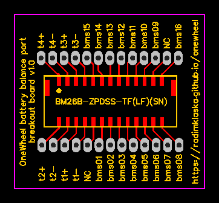

# PCBs for OneWheel

## Balance breakout

Simple breakout board for balance port on OneWheel batteries.

### BOM
* BMS Connector (PCB Side)
  * `BM26B-ZPDSS-TF(LF)(SN)`
  * [https://www.digikey.com/product-detail/en/jst-sales-america-inc/BM26B-ZPDSS-TF(LF)(SN)/455-2548-6-ND/2472626](https://www.digikey.com/product-detail/en/jst-sales-america-inc/BM26B-ZPDSS-TF(LF)(SN)/455-2548-6-ND/2472626)

### Revisions
* v1.1
  * marked positive and negative pads
  * thicker paths
  * better path separation
  * slightly bigger PCB
* v1.0
  * Initial revision.
